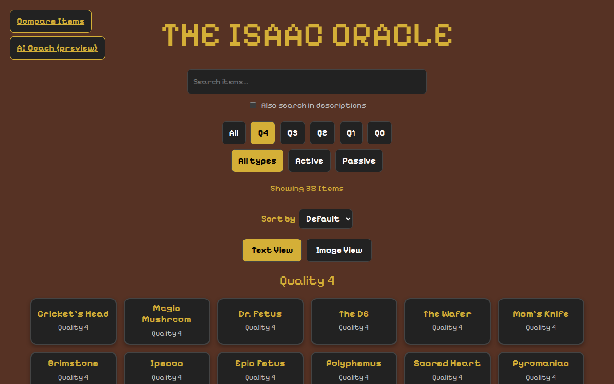
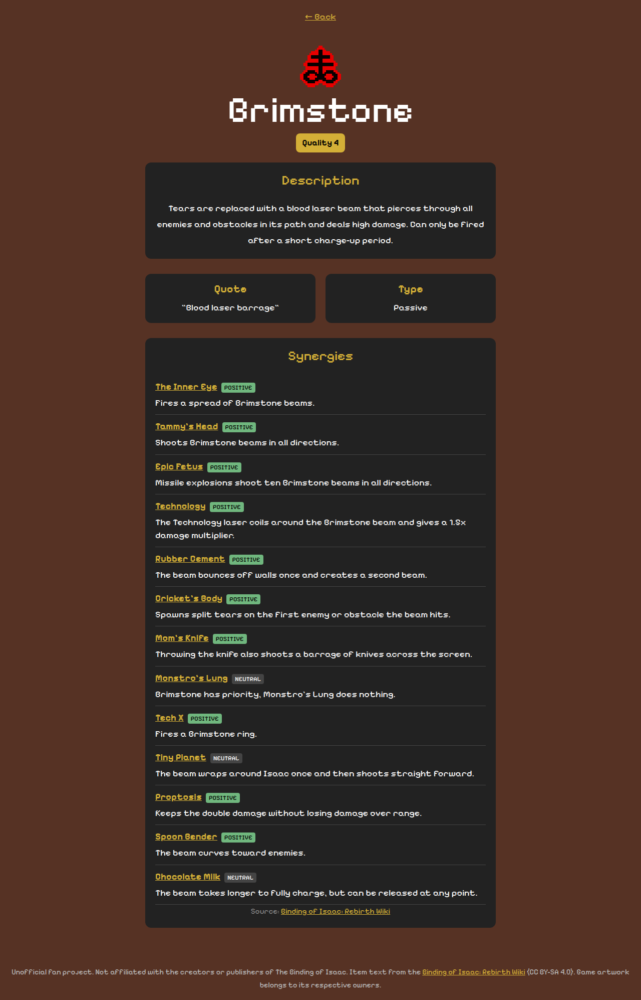
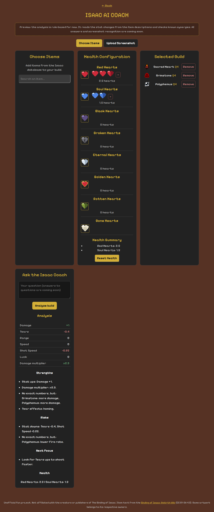

# The Isaac Oracle

[](https://github.com/lubna-ishaq/binding-of-isaac-oracle/actions/workflows/ci.yml)

A web app for **The Binding of Isaac: Rebirth** where you can look up every item, compare items, see which items work well together and get a quick analysis of your build.

Isaac has more than 700 items, lots of different heart types and thousands of item combinations, and the information is spread over many wiki pages. The goal of this project is to have all of it in one place.

**Live demo: https://lubna-ishaq.github.io/binding-of-isaac-oracle/**

**This is still a work in progress.** The item database, item pages, synergies, the comparison page, the health system and a first rule-based build analysis are working. AI answers and screenshot recognition are coming soon.



## What works right now

- **Item explorer:** all 719 items (171 active, 548 passive). You can search by name (or also in the descriptions), filter by quality (0 to 4) and by active/passive, sort A-Z or by quality and switch between a text view and an image view. On phones the item names are shown under the icons.
- **Item pages:** icon, quality, description, pickup quote and type for every item, plus known synergies with links to the other item.
- **Synergies:** 38 checked item pairs (good, bad and neutral), each with a link to the wiki page it comes from.
- **Compare:** pick two items and see them next to each other.
- **Health system:** red, soul, black, bone, rotten, eternal, golden and broken hearts. The hearts are pixel SVGs so they look like the game.
- **Build coach (rule-based):** pick your items and hearts and click "Analyze build". The app reads the stat changes from the item descriptions, adds them up in a table, checks the synergies in your build and gives you strengths, risks and what to look for next.
- **Data pipeline:** a Python scraper that builds the item list from the wiki.

## What I am working on

- **AI coach:** ask your own questions about the build and get real answers (right now only the rule-based analysis works)
- **More synergies:** bigger combos and character specific ones
- **Screenshot recognition:** upload a screenshot of your run and the app reads your items

| Item page | Build coach |
| --- | --- |
|  |  |

## Built with

- React 19, React Router and Vite
- Python with requests and BeautifulSoup for the scraper
- ESLint, Vitest, Testing Library and pytest, running on GitHub Actions

## Run it locally

You need Node.js 20 or newer.

```bash
git clone https://github.com/lubna-ishaq/binding-of-isaac-oracle.git
cd binding-of-isaac-oracle/frontend
npm install
npm run dev
```

Then open http://localhost:5173.

Other commands (inside `frontend/`):

- `npm run build` builds the app into `dist/`
- `npm run lint` runs ESLint
- `npm test` runs the unit and UI tests (Vitest and Testing Library)

## Item data

The items come from the item tables on the [Binding of Isaac: Rebirth Wiki](https://bindingofisaacrebirth.wiki.gg/wiki/Items).

```bash
pip install -r scraper/requirements.txt
python scraper/scrape_items.py      # downloads the tables and writes frontend/src/data/items.generated.json
python scraper/validate_items.py    # checks ids, types and quality
python -m pytest scraper/tests      # tests for the parser
```

Note: the wiki shows old and new values next to each other (for example a different quality before and after Repentance). The scraper now removes everything marked as "Removed in ..." so the app only shows the current Repentance+ values.

## Project structure

```text
frontend/
  public/            favicon, the dancing Isaac and the link preview image
  src/components/    item image and all AI coach parts
  src/data/          generated item list, synergies and the hook that loads the items
  src/pages/         home, item, compare, coach (each with its own CSS file) and UI tests
  src/utils/         build analysis, synergies, heart logic, filters, image urls, tests
scraper/             scraper, validation and tests
docs/                screenshots and heart designs
```

## Roadmap

- [x] Item explorer, item pages, compare page, health system
- [x] Item database with scraper and validation
- [x] Synergies for item pairs
- [x] Rule-based build analysis
- [ ] Bigger combos and character specific synergies
- [ ] Synergy graph with React Flow
- [ ] A real AI coach
- [ ] Screenshot recognition
- [ ] Pages for characters, bosses, enemies, trinkets, cards, runes and pills
- [ ] Rooms, floors, route planner, transformations
- [ ] Progress tracking and a better mobile layout

The full plan is in [PROJECT_BOARD.md](PROJECT_BOARD.md).

## Live demo

The app is hosted on GitHub Pages: https://lubna-ishaq.github.io/binding-of-isaac-oracle/

It is deployed by hand with the "Deploy to GitHub Pages" workflow in the Actions tab.

## Credits

This is a fan project and has nothing to do with Edmund McMillen, Nicalis or the publishers of The Binding of Isaac.

- Item names, quotes, descriptions, quality values and the synergy pairs are from the [Binding of Isaac: Rebirth Wiki](https://bindingofisaacrebirth.wiki.gg/wiki/Items) (CC BY-SA 4.0), so the generated item data uses the same license.
- The item icons are loaded from the wiki and belong to their owners.
- More details in [SOURCES.md](SOURCES.md).

## License

My code is under the [MIT License](LICENSE). The game content is not.
